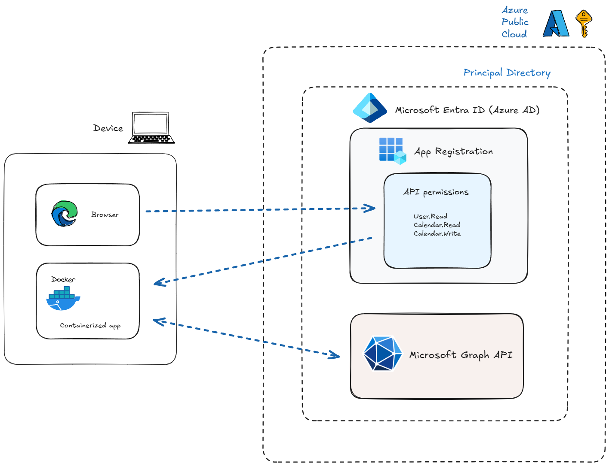

# 🔐 Azure AD Authentication with MSAL and Microsoft Graph in Python

[](https://www.python.org/downloads/)
[](https://azure.microsoft.com/services/active-directory/)
[](https://www.docker.com/)
[](https://github.com/AzureAD/microsoft-authentication-library-for-python)
[](LICENSE)

> 🐳 Fully containerized solution for secure Microsoft Graph integration

This project demonstrates Azure Active Directory (Azure AD) authentication using the Microsoft Authentication Library (MSAL) in a containerized Python console application. The app authenticates users, interacts with Microsoft Graph API to manage user data and calendar events.

## 🎯 Key Benefits

- **Secure Authentication**: Industry-standard OAuth 2.0 device flow
- **Zero Setup**: Runs anywhere with Docker
- **Automated Calendar**: Create and view events programmatically
- **Enterprise Ready**: Built with Microsoft Graph API integration
- **Type Safety**: Written in Python with type hints

## ✨ Features

1. 🔑 Secure device code authentication flow
2. 👤 User profile information retrieval
3. 📅 Calendar management (view & create events)
4. 🐳 Docker containerization for easy deployment

Example output:

```plaintext
To sign in, use a web browser to open the page https://microsoft.com/devicelogin and enter the code ABCD-EFGH to authenticate.

Welcome, John Doe!

Your upcoming calendar events:
1. Subject: Weekly Team Meeting
   Organizer: Jane Smith
   Start: 2023-12-01T10:00:00
   End:   2023-12-01T11:00:00

2. Subject: Project Review
   Organizer: Bob Johnson
   Start: 2023-12-02T14:00:00
   End:   2023-12-02T15:00:00

Your meeting was created with the following details:
Subject: Study for the AZ-204 exam
Location: Wherever you are
Start: 2023-12-01T15:05:00
End: 2023-12-01T15:35:00
```

## 🏗️ Application Architecture

This application leverages **Microsoft Entra ID (Azure AD)** for secure user authentication and **Microsoft Graph API** for accessing Microsoft 365 resources. The app is containerized using Docker and uses the **Device Flow** authentication mechanism, allowing seamless communication between the user's device and Azure cloud services.

<p align="center">
   
</p>

<p align="center">
   <em>Figure 1: Cloud Architecture showing the interaction between the containerized application, Microsoft Entra ID, and Microsoft Graph API</em>
</p>

### Cloud Components

#### 1. Microsoft Entra ID (Azure AD)

- **Authentication and Token Issuance**:
  - Handles user authentication using the **Device Flow**
  - Issues:
    - **Access Token**: For Microsoft Graph API access
    - **ID Token**: For user identity validation
    - **Refresh Token**: For token renewal

#### 2. App Registration

- **Purpose**: Defines app identity and permissions
- **Key Configuration**:
  - Public Client Flow enabled
  - API Permissions:
    - `User.Read`: Profile access
    - `Calendars.ReadWrite`: Calendar management

#### 3. Microsoft Graph API

- **Data Access Layer**:
  - Profile data via `/me` endpoint
  - Calendar management via `/me/events` endpoint

### Application Flow

1. **Initial Request** 🔄

   ```plaintext
   App -> Azure AD: Request device code
   Azure AD -> App: Returns code + verification URL
   ```

2. **User Authentication** 🔐

   ```plaintext
   User -> Browser: Opens microsoft.com/devicelogin
   User -> Browser: Enters device code
   Browser -> Azure AD: Completes authentication
   ```

3. **Token Acquisition** 🎟️

   ```plaintext
   App -> Azure AD: Polls for tokens
   Azure AD -> App: Returns access & refresh tokens
   ```

4. **API Integration** 📡

   ```plaintext
   App + Access Token -> Microsoft Graph: API requests
   Microsoft Graph -> App: Returns requested data
   ```

## 🚀 Quick Start in 3 Steps

### 1️⃣ Clone & Configure

```bash
# Clone the repository
git clone https://github.com/xmedinavei/az-deviceflow-auth-app
cd az-deviceflow-auth-app

# Create environment file
cp .env.template .env
```

### 2️⃣ Set Credentials

Edit `.env` file with your Azure AD credentials:

```env
CLIENT_ID=your-client-id-from-azure-portal
TENANT_ID=your-tenant-id-from-azure-portal
```

### 3️⃣ Build & Run

```bash
# Build the Docker image
docker build -t az-deviceflow-auth-app .

# Run the container
docker run --rm -it --env-file .env az-deviceflow-auth-app
```

## 📋 Prerequisites

### Required Tools

- Docker Desktop
- Azure Account
- Text Editor (for .env configuration)

### Azure AD Setup

1. Go to [Azure Portal](https://portal.azure.com)
2. Navigate to Microsoft Entra ID > App registrations
3. Click "New registration"
4. Set a name for your application
5. Select "Accounts in this organizational directory only"
6. Click Register

After registration:

1. Note down the following values (you'll need them later):

   - **Application (client) ID** - Found on the app registration Overview page
   - **Directory (tenant) ID** - Also found on the Overview page

2. Configure the app for public client flow:

   - Go to Authentication
   - Scroll to "Advanced settings"
   - Under "Allow public client flows", toggle to "Yes"
   - Add a Mobile and desktop redirect URI (e.g., <http://localhost>)
   - Save changes

3. Set API Permissions:
   - Go to "API permissions"
   - Add "Microsoft Graph" permissions:
     - User.Read (for profile access)
     - Calendars.ReadWrite (for viewing and creating calendar events)
   - Click "Grant admin consent"

## 🔍 Implementation Details

### Project Structure

```text
├── assets/           # Project assets and diagrams
│   └── msalapp-cloud-architecture.png
├── .env              # Environment variables (git ignored)
├── .env.template     # Environment template
├── auth_app.py       # Main application code
├── requirements.txt  # Python dependencies
├── Dockerfile        # Container configuration
└── README.md        # This documentation
```

### Microsoft Graph Integration

The application demonstrates several Microsoft Graph API capabilities:

1. **User Profile Access**

   - Fetches user's display name and basic information
   - Uses Microsoft Graph `/me` endpoint

2. **Calendar Management**

   - Lists upcoming calendar events (up to 5)
   - Creates new calendar events automatically
   - Supports custom event duration
   - Uses Microsoft Graph `/me/events` endpoints

3. **Authentication**
   - Device code flow for headless authentication
   - Token management and caching
   - Secure scope handling

### Security Considerations

- **Token Cache**: Located at `msal_token_cache.bin` (container-scoped)
- **Security**: Credentials passed as runtime parameters
- **Environment**: Copy `.env.template` to `.env` and fill in your values
- **Dependencies**: Update `requirements.txt` and rebuild container as needed

## 🤝 Let's Connect!

Are you passionate about Cloud Infrastructure and Azure solutions? Let's connect and discuss more about:

- Software Engineering
- Cloud Architecture
- Infrastructure as Code
- Generative AI

[](https://linkedin.com/in/xmedinavei)
[](https://github.com/xmedinavei)
[](https://xaviermedina.hashnode.dev/)

> 💡 Feel free to reach out if you have questions about this project or want to discuss cloud infrastructure solutions!

## 📚 Further Learning

### Microsoft Official Documentation

- [Implement Microsoft Identity](https://learn.microsoft.com/training/paths/implement-microsoft-identity/) | [Authentication Flows](https://learn.microsoft.com/training/modules/implement-authentication-by-using-microsoft-authentication-library/) | [Microsoft Graph Fundamentals](https://learn.microsoft.com/training/paths/m365-msgraph-fundamentals/) | [Device Code Flow](https://learn.microsoft.com/azure/active-directory/develop/v2-oauth2-device-code) | [App Registration Guide](https://learn.microsoft.com/azure/active-directory/develop/quickstart-register-app) | [Authentication Flows](https://learn.microsoft.com/azure/active-directory/develop/authentication-flows-app-scenarios) | [Graph API Reference](https://learn.microsoft.com/graph/api/overview?view=graph-rest-1.0) | [Calendar API](https://learn.microsoft.com/graph/api/resources/calendar?view=graph-rest-1.0) | [Python SDK Guide](https://learn.microsoft.com/graph/sdks/sdk-installation?tabs=pip#install-the-microsoft-graph-python-sdk) | [Identity Security](https://learn.microsoft.com/security/identity-access/overview-identity-access-security-best-practices)

### Hands-on Labs & Samples

- [Build Python Apps with Microsoft Graph](https://learn.microsoft.com/graph/tutorials/python) | [Secure Python Apps with Identity](https://learn.microsoft.com/azure/active-directory/develop/tutorial-v2-python-webapp) | [Graph Training Module](https://learn.microsoft.com/training/modules/msgraph-python-apps/) | [Python Daemon Sample](https://github.com/Azure-Samples/ms-identity-python-daemon) | [Python WebApp Sample](https://github.com/Azure-Samples/ms-identity-python-webapp) | [Graph Python SDK](https://github.com/microsoftgraph/msgraph-sdk-python)

> 💡 **Pro Tip**: Start with Microsoft Learn paths for structured learning, then dive into hands-on labs for practical experience.

For more details about MSAL, see [MSAL Python Documentation](https://github.com/AzureAD/microsoft-authentication-library-for-python)
